<p align="center"></p>

<p align="center"><b>A Pokémon save editor and bank for Android, with support for dual-screen handhelds.</b></p>

<p align="center">
  <a href="https://discord.gg/bMtzZmTDfu"></a>
  <a href="https://github.com/sofianeelhor/PKForge/releases"></a>
  <a href="https://github.com/sofianeelhor/PKForge/wiki"></a>
  <a href="LICENSE"></a>
</p>

---


A Pokémon save editor and cross-generation Bank for Android, tuned for dual-screen
handhelds like the AYN Thor.
Built on [PKHeX.Core](https://github.com/kwsch/PKHeX) with the
[Auto Legality Mod](https://github.com/santacrab2/PKHeX-Plugins) built in, so
legalizing a Pokémon works fully offline, on device.

<p align="center">
  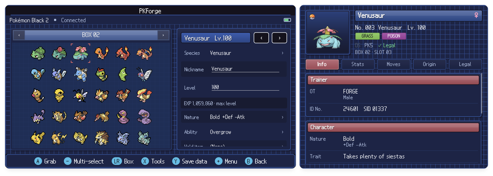
</p>

Every screen, every emulator and every feature is explained with screenshots in the
**[PKForge wiki](https://github.com/sofianeelhor/PKForge/wiki)**.

Not affiliated with Nintendo, Game Freak, or The Pokémon Company.

## Features

- **Manage your Pokémon.** Open any save from a linked emulator or a single file and
  take full control of your team and boxes. Edit stats, IVs, EVs, moves, nature,
  ability, held item, Met/Origin, Tera type, Hyper Training, shininess, friendship,
  Pokérus, and more, with a live legality check as you go.
- **One-tap legalize.** The Auto Legality Mod is built into the app, so legalizing a
  Pokémon works fully offline, on device.
- **Move Pokémon between games.** Grab a Pokémon from one save and drop it into another,
  across generations, from Gen 1 to Gen 9 and back. A preview shows every change and
  the legality verdict before anything is written.
- **A Bank like Pokémon Home.** Store your whole collection in a cross-game Bank with
  as many themed boxes as you need. Organize with the gamepad, keep living dexes, and pull
  anything back out into any save whenever you need it.
- **Track your collection.** The Living Dex tracker follows all 1025 Pokémon across
  every generation, including shiny variants, so you always know what you still need.
- **Living Dex Autopilot.** Builds a living dex from the Pokémon you already own across
  all your games and the Bank. It moves Pokémon (never copies them), evolves trade
  evolutions on the way, and writes nothing until you confirm.
- **Browse and inject events.** The full Mystery Gift database is bundled and works
  offline. Browse Wonder Cards from old distributions and inject them straight into
  your save.
- **Edit the bag.** The bag editor handles any pouch, any item, any quantity, with
  presets and one-tap refills.
- **Edit the trainer.** Change your name, IDs, money, and gender on the trainer card,
  and manage trainer profiles and records.
- **RNG tools.** Inspect PID, IVs, and nature, and reroll a nature while keeping
  shininess.
- **Batch edit.** The organizer handles multi-select operations: copy, move, duplicate,
  delete, release, and send to the Bank or Poképark in bulk.
- **Breed and hatch.** The egg factory and Day Care / Nursery tools generate eggs and
  hatch Pokémon, including one egg of every species.
- **Complete the Pokédex.** Mark everything seen, generate a living dex, and track
  what is missing.
- **Play with your Pokémon.** The Poképark is a living habitat where your Pokémon
  wander while you're away. The Nuzlocke report tracks first encounters and dupes per
  route, and the encounter browser shows every way to catch a species in each game.
- **Share your teams.** Import and export Showdown sets, and generate QR codes to move
  a set between devices.
- **Game-specific editors.** Grand Underground, Poké Beans, Fashion, and more for each
  game.
- **World & events.** Clock repair for Ruby / Sapphire / Emerald, roaming legendaries,
  re-arming one-time encounters, Entralink and Dream World, Apricorn Box and Pokéwalker,
  honey trees, event flags, and key item events such as the Eon Ticket or the GS Ball.
- **Organize boxes.** Box manager (move, lock, copy, rename, wallpapers), sort by dex,
  level, IVs, type or age, and a legality check and audit of the whole save.
- **ROM hacks.** Pokémon Unbound, Radical Red, GS Chronicles, Luminescent Platinum and
  Pokémon Compass are supported with their own data. Unknown hacks open read-only with a
  warning.
- **HaX and Hardcore modes.** HaX lifts the legality limits. Hardcore turns data editing
  off for challenge runs and RetroAchievements players, while moving Pokémon stays
  possible.
- **Built for handhelds.** Fully playable with a gamepad or by touch. On dual-screen
  devices the second screen shows the Pokémon inspector, game art, Pokédex entries or
  the Poképark journal.
- **Keep your saves safe.** Every write is validated, then preceded by a restore point.
  Only the Pokémon you touched may change, and risky saves open read-only. The 20 most
  recent restore points are kept.

## Screenshots

<p align="center">
  
  
</p>

<p align="center">
  
  
</p>

<p align="center">
  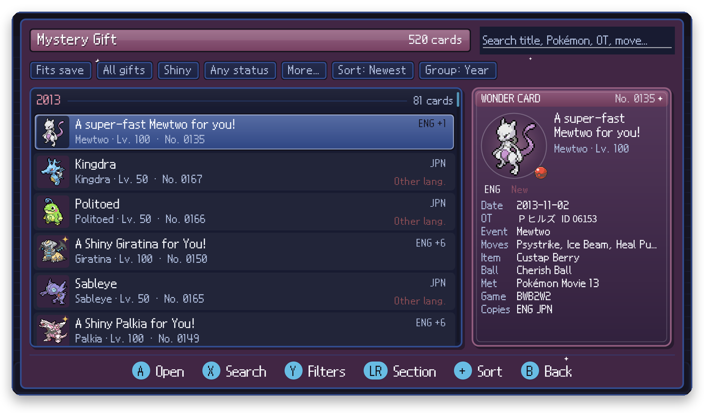
  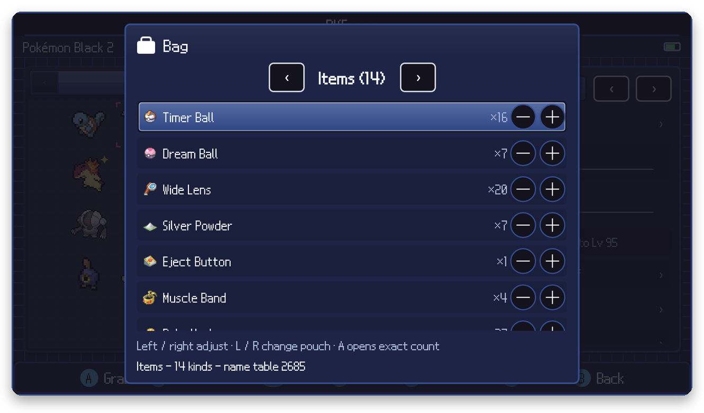
</p>

<p align="center">
  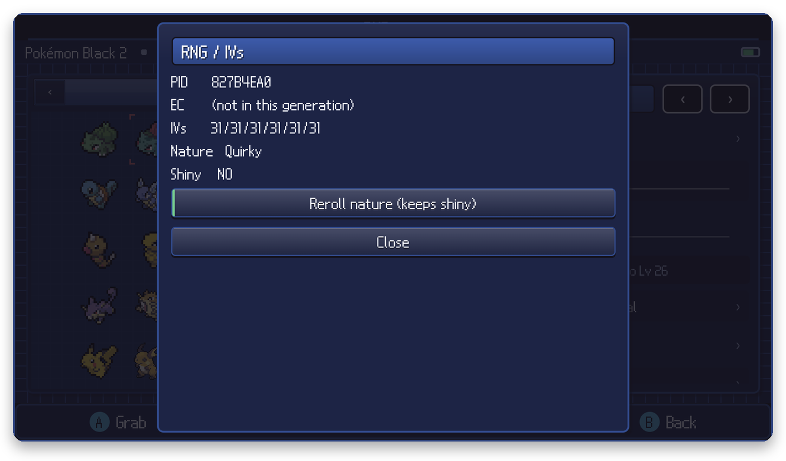
  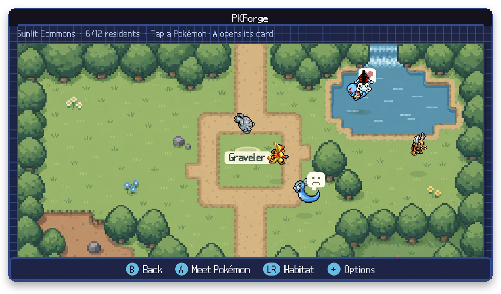
</p>

<p align="center">
  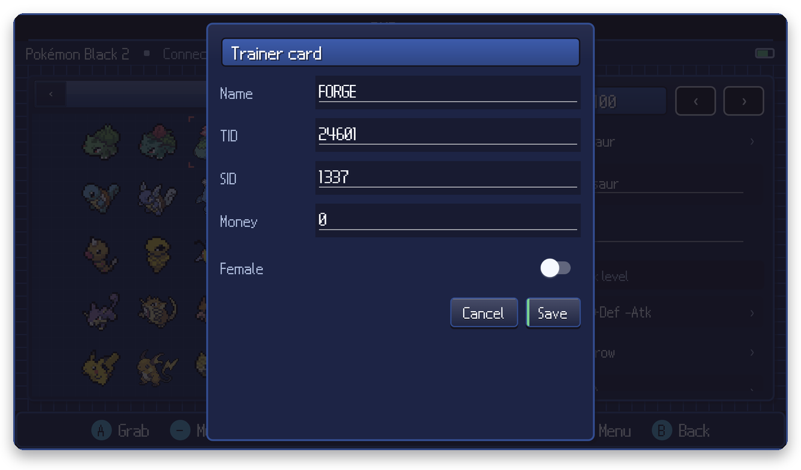
  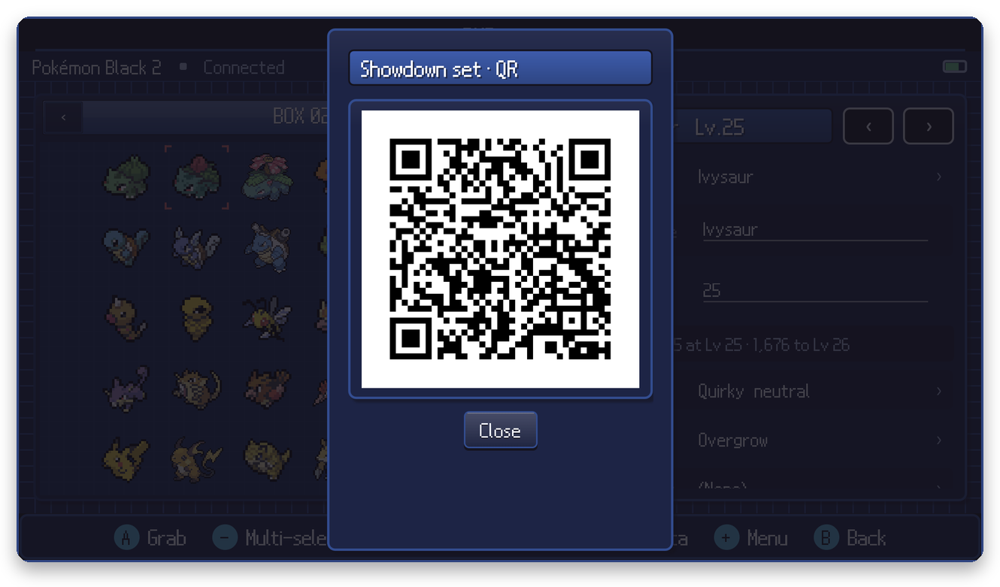
</p>

<p align="center">
  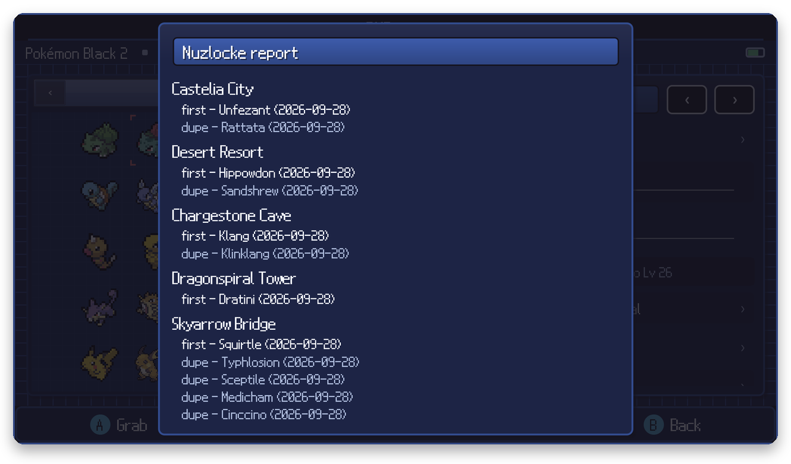
  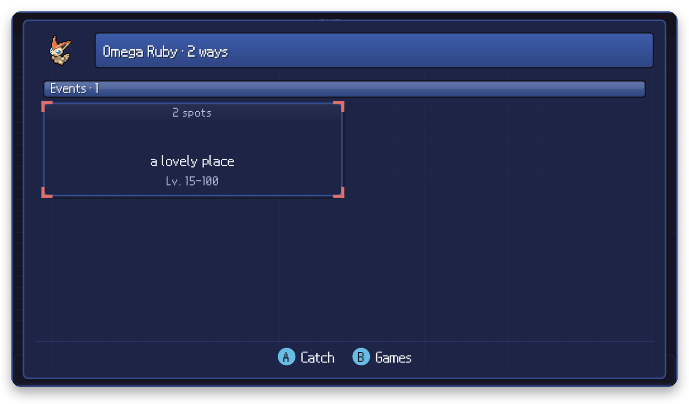
</p>

<p align="center">
  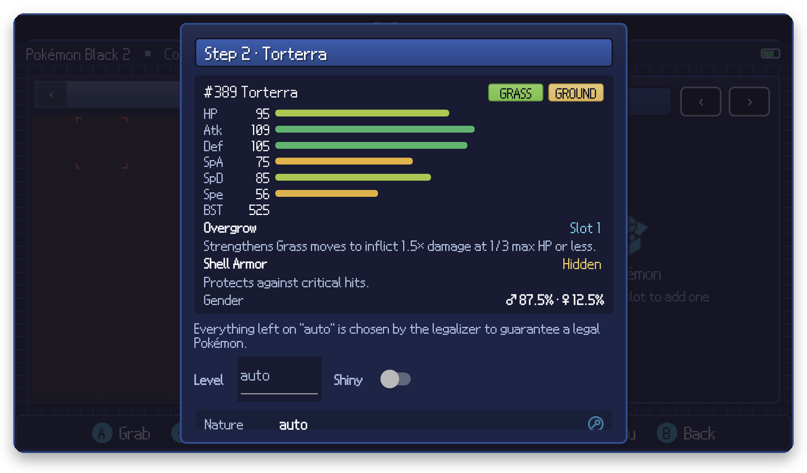
  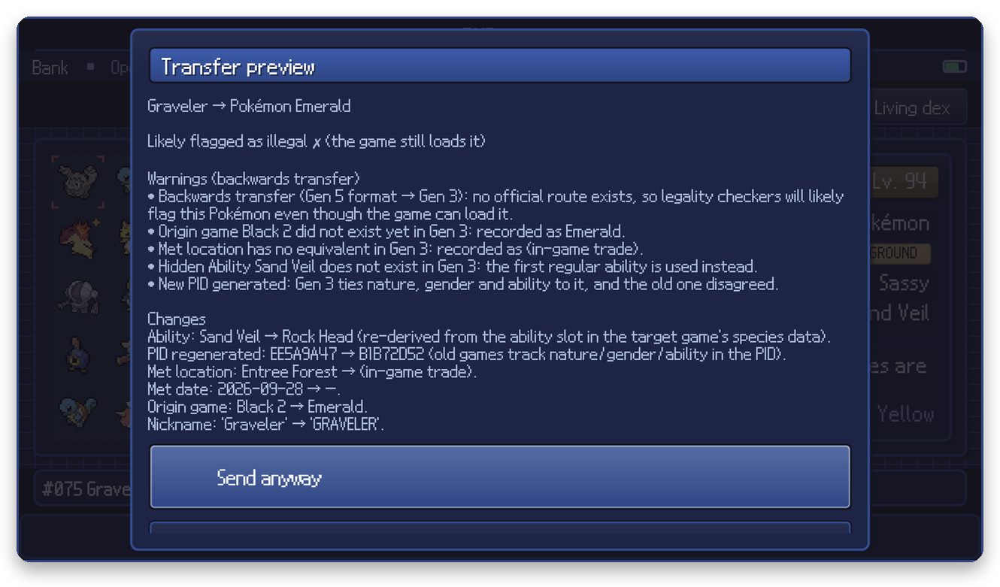
</p>

<p align="center">
  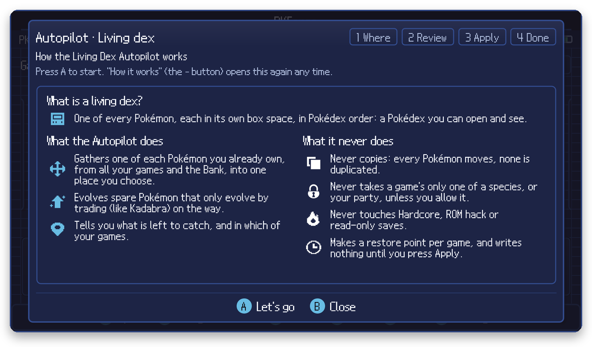
  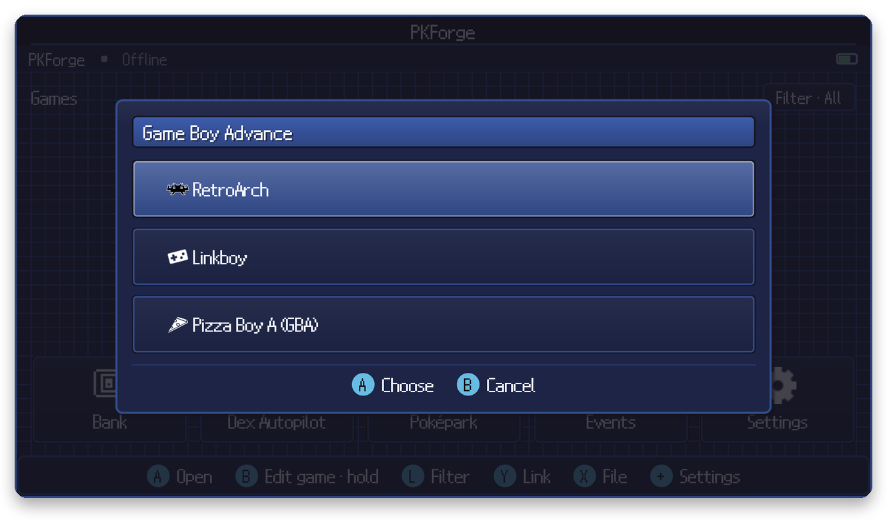
</p>

## Supported games

PKForge reads and edits saves from every mainline generation, plus the GameCube side
games and popular romhacks:

- **Generation I:** Red, Blue, Green (JP), Yellow
- **Generation II:** Gold, Silver, Crystal
- **Generation III:** Ruby, Sapphire, Emerald, FireRed, LeafGreen, Pokémon Box: Ruby & Sapphire, Colosseum, XD: Gale of Darkness
- **Generation IV:** Diamond, Pearl, Platinum, HeartGold, SoulSilver
- **Generation V:** Black, White, Black 2, White 2
- **Generation VI:** X, Y, Omega Ruby, Alpha Sapphire
- **Generation VII:** Sun, Moon, Ultra Sun, Ultra Moon, Let's Go Pikachu, Let's Go Eevee
- **Generation VIII:** Sword, Shield, Brilliant Diamond, Shining Pearl, Legends: Arceus
- **Generation IX:** Scarlet, Violet
- **Romhacks:** Pokémon Unbound, Radical Red, GS Chronicles, Luminescent Platinum, Pokémon Compass

## Supported emulators

Link a storage unit and PKForge finds your saves automatically:

- **Game Boy / Game Boy Color:** RetroArch, Linkboy, Pizza Boy C
- **Game Boy Advance:** RetroArch, Linkboy, Pizza Boy A
- **Nintendo DS:** melonDS, DraStic, RetroArch
- **GameCube:** Dolphin
- **Nintendo 3DS:** Azahar, Lime3DS, Citra MMJ
- **Nintendo Switch:** Eden

You can also open a single save file directly.

## Installation

Download the APK from [Releases](https://github.com/sofianeelhor/PKForge/releases) and
allow installs from unknown sources. First run walks you through linking an emulator or
opening a single save file.

New to PKForge? Start with [Getting Started](https://github.com/sofianeelhor/PKForge/wiki/Getting-Started).
If PKForge finds no saves, the folder picked is usually the wrong one: see
[Choosing the right folder](https://github.com/sofianeelhor/PKForge/wiki/Choosing-the-Right-Folder).

## 💬 Discord

Join for updates, support, bug reports, feature requests, or just to chat about the project.

👉 **[Join the PKForge Discord](https://discord.gg/bMtzZmTDfu)**

[](https://discord.gg/bGKEyfY)

## Building

.NET 10 SDK with the `maui-android` workload, Android SDK (API 36).

```bash
git submodule update --init --recursive
dotnet test tests/PKForge.Domain.Tests/PKForge.Domain.Tests.csproj
dotnet test tests/PKForge.Engine.Tests/PKForge.Engine.Tests.csproj
dotnet build src/PKForge.App/PKForge.App.csproj -f net10.0-android
```

Version tags build and publish the APK from CI.

### Layout

```
src/PKForge.Domain          contracts and DTOs, no engine or Android dependencies
src/PKForge.Engine          adapters over pinned PKHeX.Core
src/PKForge.AutoMod         compiles the Auto Legality Mod against our Core
src/PKForge.Infrastructure  bank, backups, atomic save writer
src/PKForge.App             MAUI app, SkiaSharp UI, gamepad and second screen
src/PKForge.Chrome          the design system: tokens and painters, pure Skia
tools/ChromePreview         renders the design system off-device
docs/                       architecture, bank model, development, art direction
```

## Credits

- [PKHeX](https://github.com/kwsch/PKHeX) by Kaphotics and every contributor over the
  years, the engine everything runs on
- [spritedmistery](https://www.instagram.com/spritedmistery/), the PKForge logo and several
  of the app's assets
- [PKHeX-Plugins / Auto Legality Mod](https://github.com/santacrab2/PKHeX-Plugins), the
  offline legalizer built into the app
- [PKSM](https://github.com/FlagBrew/PKSM), the pixel chrome this UI builds on (GPL-3,
  see [UI attribution](src/PKForge.App/Resources/UI/ATTRIBUTION.md))
- [SteamGridDB](https://www.steamgriddb.com), cartridge icons, second-screen logos, and
  hero banners for the game library (community submissions; see
  [game art attribution](src/PKForge.App/Resources/GameArt/ATTRIBUTION.md))
- [PokeAPI](https://pokeapi.co), item art fetched at runtime and cached on device
- [game-icons.net](https://game-icons.net) (CC-BY 3.0, © Lorc, Delapouite, Guard13007,
  Carl Olsen and other contributing artists), UI symbols
- [Bulbagarden Archives](https://archives.bulbagarden.net), Pokérus status sprites
- Sprites and Pokémon names © Nintendo, Creatures Inc., GAME FREAK inc.

## License

GPLv3 or later, inherited from PKHeX.Core. See [LICENSE](LICENSE).
